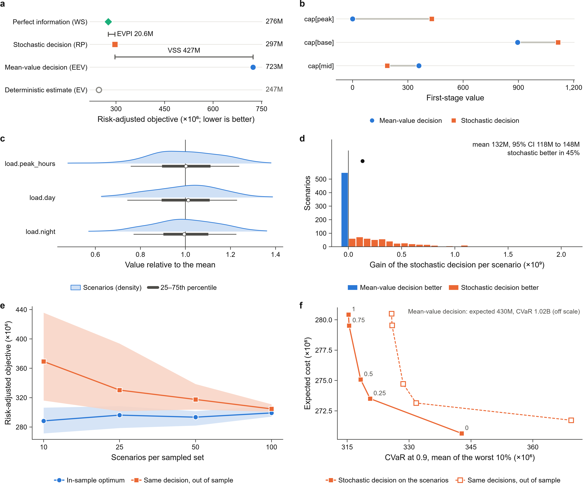

# Figures

Every report contains figures ready for a journal: drawn at their final print size, with a draft
legend for each figure and the numbers behind it.



## What a report contains

| File | Content |
| --- | --- |
| `fig_overview` | All panels in one two-column figure, lettered **a**–**f** |
| `fig_value` | Expected outcome of each decision on one scale, with VSS and EVPI as brackets |
| `fig_first_stage` | First-stage decision of the mean-value and the stochastic model |
| `fig_scenarios` | Distribution of the uncertain entries across the scenarios (and the history) |
| `fig_out_of_sample` | Out-of-sample outcome of both decisions (box: quartiles; whiskers: 5th–95th percentiles) |
| `fig_gain` | Paired out-of-sample gain per scenario, with the mean and its 95% bootstrap interval |
| `fig_stability` | In-sample optimum and out-of-sample result as the number of scenarios grows |
| `fig_risk_frontier` | Expected outcome against CVaR as the weight on CVaR grows |
| `captions.md` | A draft legend for every figure, generated from the results |
| `source_data/*.csv` | The numbers plotted in each figure |

Each figure is written as PDF, SVG and 600-dpi PNG. The figures that need out-of-sample data,
stability runs or a risk frontier appear when those were computed.

## The `nature` style (default)

It follows the artwork guidelines of Nature-family journals:

- **Size.** One column is 89 mm wide, the overview two columns (183 mm); heights stay below 230 mm.
- **Text.** Arial (or Helvetica) at 7 pt for labels and 6 pt for ticks; panel letters are bold
  lower-case at 8 pt. No titles inside the artwork: what a figure shows belongs in its legend.
- **Editable.** PDFs embed TrueType fonts (no Type 3), and SVG keeps text as text, so labels can be
  edited in Illustrator or Inkscape.
- **Numbers.** Large values are shown in units of 10³, 10⁶ or 10⁹, with the factor in the axis
  label; negative numbers use a true minus sign.
- **Colour.** Each decision keeps one colour and one marker shape in every figure (mean-value:
  blue circle; stochastic: orange square; perfect information: green diamond). The three colours
  pass colour-vision-deficiency checks, and the marker shapes keep them apart in grayscale.
- **Source data and legends.** Journals ask for both; `source_data/` and `captions.md` provide them.

The test suite checks these rules for every figure: the width, the font sizes (5–8 pt), line
widths, the absence of titles and Type 3 fonts, and that the source data match the results.

On Linux, install Arial, or Liberation Sans (metrically identical), so text is not set in the
fallback face.

## Other styles and formats

```bash
stochlift run model.py --style presentation    # slide size, larger text, with titles
```

```python
study.report("report/", style="presentation")
study.figures("figs/")                          # only the figures, legends and source data
```

## Building your own figure

Each panel is a function that draws into a matplotlib figure or subfigure, so panels can be
combined with your own:

```python
import matplotlib as mpl
from matplotlib.figure import Figure
from stochlift import plots
from stochlift.figstyle import MM, get_style

st = get_style("nature")
with mpl.rc_context(st.rc()):
    fig = Figure(figsize=(183 * MM, 60 * MM))
    left, right = fig.subfigures(1, 2)
    plots.draw_value(study, left, st)
    plots.draw_gain(study, right, st)
plots.save(fig, "figs", "my_figure", st)
```

`plots.figure(study, "gain")` returns one figure as a matplotlib `Figure`, and
`plots.overview(study, panels=["value", "gain", "frontier"])` builds an overview from the panels
you choose.
