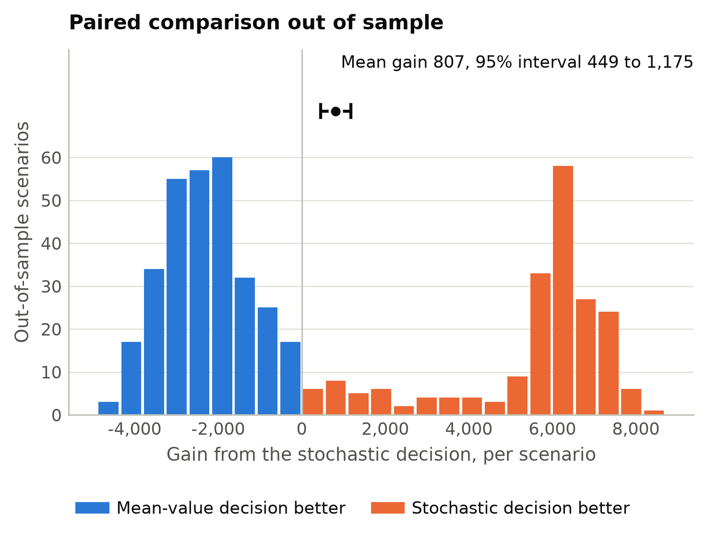

# Getting started

## Install

```bash
pip install "stochlift[pulp]"     # or [pyomo], or [all]
```

gurobipy, OR-Tools and highspy models work too; install those libraries as usual. HiGHS is the
default solver and is installed with StochLift, so no commercial license is needed.

## The farmer problem

`examples/farmer/model.py` is the deterministic farmer problem from Birge and Louveaux: plant
wheat, corn and sugar beets on 500 acres, then buy or sell after the harvest. It is an ordinary
PuLP model with a `build_model(data)` function and a `DATA` dictionary.

### From the command line

```bash
cd examples/farmer
stochlift init model.py -o my_spec.yaml
```

`init` builds the model once, groups the variables and shows where each data key enters the
model:

```text
# Variable groups (first-stage = decided BEFORE the uncertainty is known):
#   acres_*                      3 continuous, e.g. acres_wheat, acres_corn, acres_beets
#   buy_*                        2 continuous, e.g. buy_wheat, buy_corn
#   sell_*                       4 continuous, e.g. sell_wheat, sell_corn, sell_beets
#
# Numeric data keys and where they enter the model:
#   yield                        3 number(s): 3 matrix
#   ...
```

Edit the `TODO` lines: acreage is decided before the season (`first_stage: [acres_*]`) and the
yields are uncertain (`uncertain: [yield]`, with a distribution). Then:

```bash
stochlift run model.py --spec my_spec.yaml
```

### From Python

```python
import stochlift as sl
from model import DATA, build_model

scenarios = [(1/3, {"yield": {crop: f * y for crop, y in DATA["yield"].items()}})
             for f in (1.2, 1.0, 0.8)]

study = sl.lift(build_model, DATA, first_stage=["acres_*"], scenarios=scenarios)
study.review()            # the spec, the stage split, and where the uncertain data enters
results = study.solve()   # EV, WS, RP, EEV, VSS, EVPI
study.check()             # solver-checked invariants
study.report("report/")   # summary.md, results.json, LaTeX table, figures (PDF + PNG)
```

This reproduces the published values: expected profit 108,390 for the stochastic solution,
115,406 with perfect information and 107,240 for the mean-value solution, so VSS = 1,150 and
EVPI = 7,016. The test suite asserts these numbers.

## Reading the report

`report/summary.md` starts with the verdict, then the values:

| Quantity | Meaning |
| --- | --- |
| EV | the deterministic model at mean data: its own, optimistic estimate |
| WS | wait-and-see: each scenario solved with perfect information |
| RP | the stochastic (recourse) solution |
| EEV | the mean-value decision evaluated over the scenarios |
| VSS | EEV vs RP: what modeling the uncertainty gains |
| EVPI | RP vs WS: the most a perfect forecast could gain |

The verdict prefers out-of-sample evidence when there is any: an in-sample VSS is optimistic,
because the same scenarios produced the decision.


