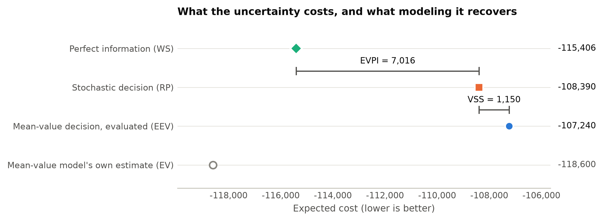

# StochLift

Turn the deterministic optimization model you already have into a two-stage stochastic program
with one command, check the result with the solver, and find out whether modeling the
uncertainty is worth it.

```bash
pip install "stochlift[pulp]"
stochlift init model.py      # writes uncertainty.yaml for you to review
stochlift run model.py       # solves, checks, writes report/
```

## Three questions

Stochastic programming tools expect the model in their own form: rewritten in their syntax,
annotated with stages and random parameters, or wrapped in a scenario-creator function.
Practitioners usually have a deterministic model that already runs in PuLP, gurobipy, OR-Tools or
Pyomo, plus a rough idea (or a history) of the numbers that turn out to be wrong. StochLift starts
there, without annotations or changes to the model, and answers three questions.

1. **What does the stochastic version of my model decide?** It is built from your own model.
2. **Is the lift correct?** Eight invariants from stochastic programming theory are checked by
   the solver. None of them needs a reference answer.
3. **Is it worth it?** The value of the stochastic solution (VSS), the value of perfect
   information (EVPI), and an out-of-sample test on data that was not used to make the decision.
   If the gain cannot be told apart from noise, the report says so.



## The only requirement

Your model is built by a function of its data:

```python
def build_model(data):      # returns a PuLP, Pyomo, gurobipy, OR-Tools or highspy model
    ...
```

`data` is a dictionary of numbers, nested dicts and lists, NumPy arrays, or pandas Series and
DataFrames. StochLift calls the function once per scenario, shares the first-stage variables
across scenarios, and builds the extensive form. It never needs to know where the uncertain
numbers enter the model.

## Where to go next

- [Getting started](getting-started.md): the farmer problem, from the command line and from Python.
- [The spec file](spec.md): every field of `uncertainty.yaml`.
- [Related tools](related.md): how StochLift compares with mpi-sppy and others, and when to use them instead.
