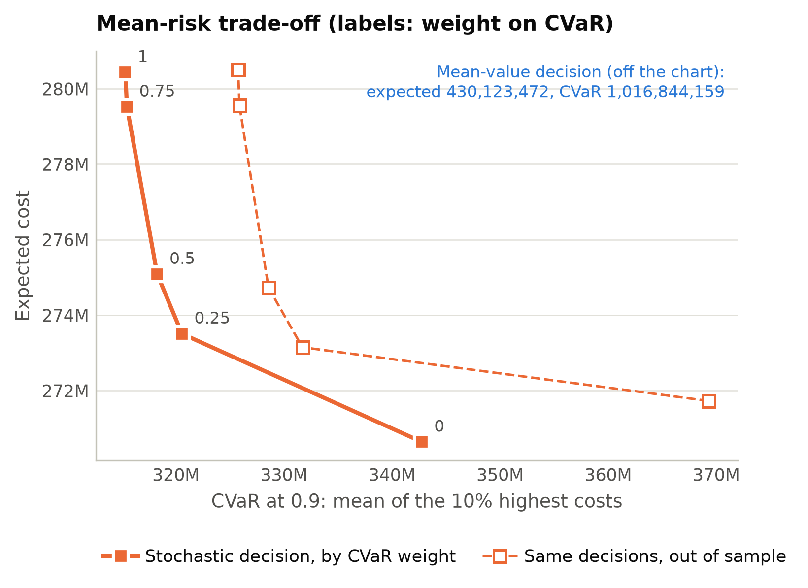

# Risk-averse decisions

A decision that is slightly cheaper on average can be much worse in a bad year. Add a `risk`
block to the spec to optimize a mix of expected cost and CVaR:

$$
\min_x \;(1 - w)\,\mathbb{E}[f(x,\xi)] + w\,\mathrm{CVaR}_\alpha[f(x,\xi)],
\qquad
\mathrm{CVaR}_\alpha[f] = \min_\eta \;\eta + \frac{\mathbb{E}[(f - \eta)^+]}{1 - \alpha}.
$$

```yaml
risk:
  alpha: 0.9      # CVaR = mean of the worst 10% of outcomes
  weight: 0.5     # half expected cost, half CVaR
```

The extensive form gets one free variable for $\eta$ and one non-negative variable per scenario
(Rockafellar and Uryasev, 2000), so the model stays a linear or mixed-integer linear program.

## What changes in the results

- WS, RP and EEV are all measured with the same objective, so VSS and EVPI are risk-adjusted and
  the bound ordering WS ≤ RP ≤ EEV still holds. The report also lists the expected cost and the
  CVaR of each decision separately.
- The out-of-sample test compares the risk-adjusted objective as well as the mean, and the
  verdict uses the risk-adjusted comparison. In the farmer example the risk-averse decision does
  worse on average out of sample (by 142) and better on the risk-adjusted objective (by 245, 95%
  interval 121 to 346). A test of the mean alone would have rejected it.

## The mean-risk frontier

```bash
stochlift run model.py --frontier 0,0.25,0.5,0.75,1
```

or `study.risk_frontier(weights=(0, 0.25, 0.5, 0.75, 1))` solves once per weight and reports the
expected cost and the CVaR of each decision, in sample and out of sample.



!!! note "Tails need scenarios"
    CVaR is estimated from the scenarios in its tail. With `alpha: 0.9` and 100 scenarios that
    is 10 scenarios, so the in-sample CVaR is optimistic. The out-of-sample curve shows by how
    much.
