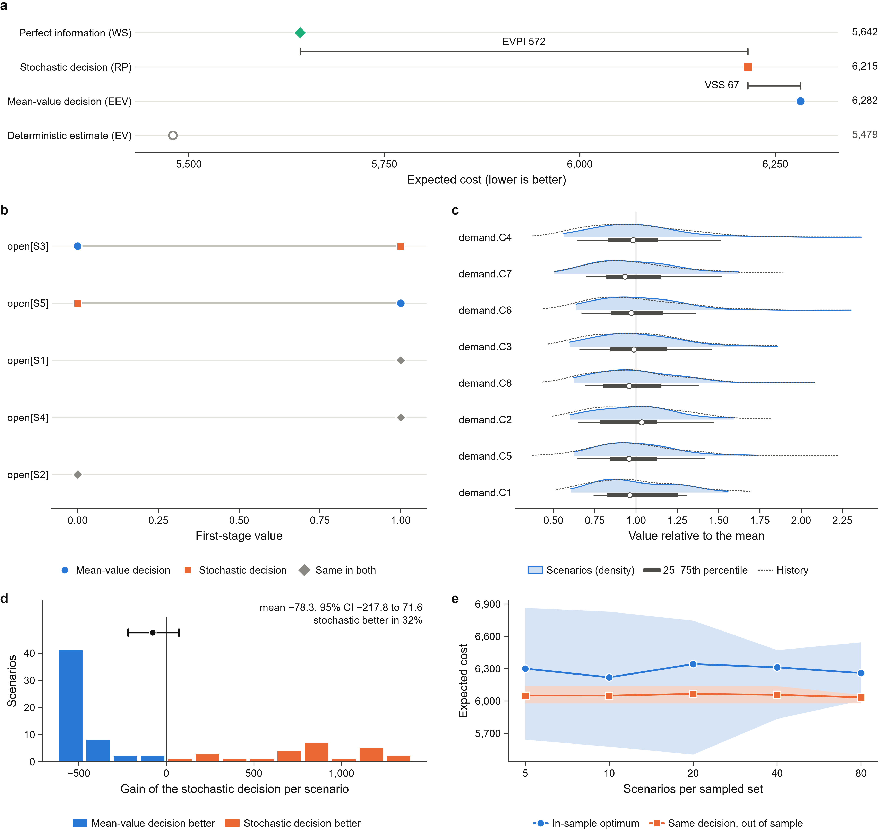

# StochLift report

Objective sense: **min** (lower is better). Scenarios: **30**.

## Is modeling the uncertainty worth it?

**Not clearly.** On the scenario set the stochastic decision is better by 67.25 per decision in expectation (1.08% of RP); this is the value of the stochastic solution (VSS). On 78 held-out observations the mean gain is -78.30 (95% interval -217.82 to 71.65). The interval contains zero, so the gain is not distinguishable from noise on unseen data.

Better forecasts are worth at most 572.37 (9.21% of RP): the expected value of perfect information (EVPI).

| Quantity | Meaning | Expected cost |
| --- | --- | ---: |
| EV | deterministic model at mean data (its own, optimistic estimate) | 5,479.48 |
| WS | wait-and-see: each scenario solved with perfect information | 5,642.40 |
| RP | stochastic (recourse) solution | 6,214.77 |
| EEV | the mean-value decision evaluated over the scenarios | 6,282.02 |
| VSS | EEV vs RP | 67.25 |
| EVPI | RP vs WS | 572.37 |

## First-stage decision

| Variable | Mean-value model | Stochastic model |
| --- | ---: | ---: |
| open[S3] | 0 | 1 |
| open[S5] | 1 | 0 |
| open[S1] | 1 | 1 |
| open[S2] | 0 | 0 |
| open[S4] | 1 | 1 |

2 of 5 first-stage variables differ.

## Out-of-sample test

Both decisions were applied to 78 held-out observations that were not used to build the scenarios.

- Mean cost: mean-value decision 5,979.11, stochastic decision 6,057.41.
- Mean gain of the stochastic decision: -78.30 per observation, 95% bootstrap interval [-217.82, 71.65].
- The stochastic decision was better in 32% of the observations and worse in 68%.
- Feasible observations: mean-value 78/78, stochastic 78/78.

## Solution quality

Optimality gap of the stochastic solution (Mak-Morton-Wood estimate, 20 batches of 50 scenarios): mean 12.17, 95% upper bound 24.88 (0.40% of RP).

## Checks

- **PASS** `builder_deterministic`: two builds from the same data give the same model
- **PASS** `uncertainty_reaches_model`: coefficients affected: demand -> 8 rhs
- **PASS** `stage_split`: 5 first-stage and 48 recourse variables
- **PASS** `first_stage_rows_stable`: constraints on first-stage variables only are the same in every scenario
- **PASS** `single_scenario_reduction`: one-scenario lift = 5479.48, deterministic model = 5479.48
- **PASS** `bound_ordering`: WS <= RP <= EEV: WS = 5642.4, RP = 6214.77, EEV = 6282.02
- **PASS** `decomposition_consistency`: extensive form = 6214.77; re-solving each scenario with the first stage fixed gives 6214.77
- **PASS** `mean_value_recourse`: the mean-value first stage is feasible in every scenario

The checks verify that the lift is mathematically consistent with the deterministic model. They cannot verify that the stage assignment matches how decisions are made in practice; that is confirmed by reviewing `uncertainty.yaml`.

## Figures

Legends for every figure are in `captions.md`, and the numbers behind each figure in `source_data/`. Files: `fig_overview`, `fig_value`, `fig_first_stage`, `fig_scenarios`, `fig_out_of_sample`, `fig_gain`, `fig_stability` (PDF, SVG and PNG).
