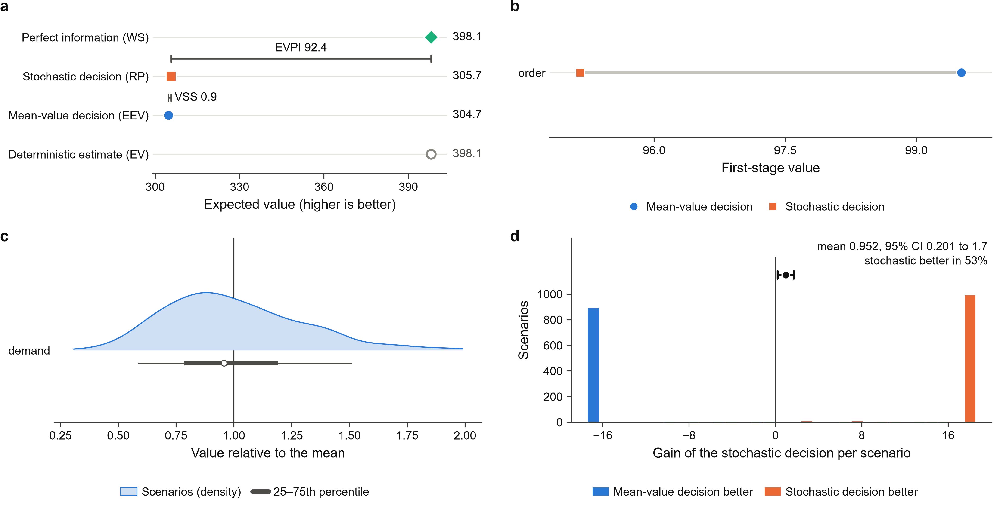

# StochLift report

Objective sense: **max** (higher is better). Scenarios: **400**.

## Is modeling the uncertainty worth it?

**Yes.** On the scenario set the stochastic decision is better by 0.93 per decision in expectation (0.30% of RP); this is the value of the stochastic solution (VSS). On 2000 independent samples from the distributions the mean gain is 0.95 (95% interval 0.20 to 1.70).

Better forecasts are worth at most 92.41 (30.23% of RP): the expected value of perfect information (EVPI).

| Quantity | Meaning | Expected value |
| --- | --- | ---: |
| EV | deterministic model at mean data (its own, optimistic estimate) | 398.06 |
| WS | wait-and-see: each scenario solved with perfect information | 398.06 |
| RP | stochastic (recourse) solution | 305.66 |
| EEV | the mean-value decision evaluated over the scenarios | 304.73 |
| VSS | EEV vs RP | 0.93 |
| EVPI | RP vs WS | 92.41 |

## First-stage decision

| Variable | Mean-value model | Stochastic model |
| --- | ---: | ---: |
| order | 99.52 | 95.15 |

1 of 1 first-stage variables differ.

## Out-of-sample test

Both decisions were applied to 2000 independent samples from the distributions that were not used to build the scenarios.

- Mean value: mean-value decision 306.42, stochastic decision 307.38.
- Mean gain of the stochastic decision: 0.95 per observation, 95% bootstrap interval [0.20, 1.70].
- The stochastic decision was better in 53% of the observations and worse in 47%.
- Feasible observations: mean-value 2000/2000, stochastic 2000/2000.

## Checks

- **PASS** `builder_deterministic`: two builds from the same data give the same model
- **PASS** `uncertainty_reaches_model`: coefficients affected: demand -> 1 rhs
- **PASS** `stage_split`: 1 first-stage and 2 recourse variables
- **PASS** `first_stage_rows_stable`: constraints on first-stage variables only are the same in every scenario
- **PASS** `single_scenario_reduction`: one-scenario lift = 398.064, deterministic model = 398.064
- **PASS** `bound_ordering`: WS >= RP >= EEV: WS = 398.064, RP = 305.655, EEV = 304.729
- **PASS** `decomposition_consistency`: extensive form = 305.655; re-solving each scenario with the first stage fixed gives 305.655
- **PASS** `mean_value_recourse`: the mean-value first stage is feasible in every scenario

The checks verify that the lift is mathematically consistent with the deterministic model. They cannot verify that the stage assignment matches how decisions are made in practice; that is confirmed by reviewing `uncertainty.yaml`.

## Figures

Legends for every figure are in `captions.md`, and the numbers behind each figure in `source_data/`. Files: `fig_overview`, `fig_value`, `fig_first_stage`, `fig_scenarios`, `fig_out_of_sample`, `fig_gain` (PDF, SVG and PNG).
